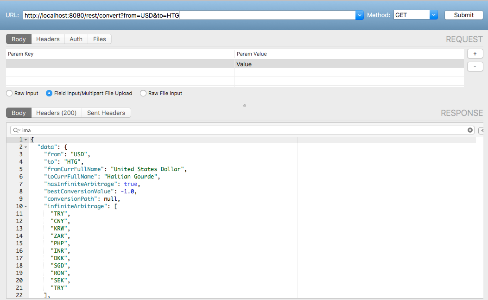

# Rest API for Currency Arbitrage
This repository is created by Stephane Miguel KAKANAKOU. For any questions or suggestion, you can contact me at Skakanakou@gmail.com

## What is Currency Arbitrage
The currency arbitrage is the fact of taking advantage of divergences in exchange rates in different money markets by buying a currency in one market and selling it in another market.

## What is the goal of this project
The goal of this project is to build a REST API that allow, given two currenies (the source and the destination), to find if there is an infinite arbitrage between the two currencies. In the case there is no infinite arbitrage, the response will be the path that maximize the conversion from the source currency to the destination currency.

## Implementation Details
### Database
The first step is to get the currency rates. For that, I use query the **Fixer.io** REST API. You can find more details about the **Fixer.io** REST API [here](http://fixer.io). 
 For this project, I use the **inMemory NoSQL database REDIS**. 
 For the database configuration, I follow the following differents steps : 

* **STEP 1** : I build a text file that contains all the supported currencies.  Here is the link to the file [supported currencies](https://github.com/MiguelSteph/CurrencyArbitrageRestAPI/blob/master/CurrencyConversionAPI/src/main/resources/supportedCurrencies/supportedCurrencies.txt). 
* **STEP 2** : I then create four data transfer objects. One for currency and on for the Edges between currencies, one that help to convert the **Fixier.io** REST API response to java class; and the last one that wrapper the response to client query. Here are the link to the java files [DTO](https://github.com/MiguelSteph/CurrencyArbitrageRestAPI/tree/master/CurrencyConversionAPI/src/main/java/com/convertion/dto).
* **STEP 3** : I create a data service that contains two mains methods : one to parse the supported currencies file and load it in the database and the second that for each supported currency query **Fixier.io** REST API and convert the answer into the corresponding java DTO class and treat it to save each edge with its rate in the database. Here is the link to the java file [DataService](https://github.com/MiguelSteph/CurrencyArbitrageRestAPI/blob/master/CurrencyConversionAPI/src/main/java/com/convertion/services/DataService.java)
* **STEP 4** : We then write a JUnit test to test the service and in the same time to load the data in the database. Here is the link to the JUnit test file [test](https://github.com/MiguelSteph/CurrencyArbitrageRestAPI/blob/master/CurrencyConversionAPI/src/test/java/com/convertion/rest/TestDataService.java)

### REST API
The API supports two type of query : 

* Get the supported currencies
* Find infinite arbitrage between two curencies.

To implement the REST API, I go through the following step : 

* **STEP 1**: Create a the query service that contains two methods. The first method return a collection of supported currencies. The second method take two currencies and use the **BellMan-Ford** algorithm to find the shortest path between the currencies. During the **BellMan-Ford** algorithm, we replace the original rates by -log_2(rate)
Like that the problem of maximization is transformed into minimization problem with negative weight.
Here is the link to the java file [QueryService](https://github.com/MiguelSteph/CurrencyArbitrageRestAPI/blob/master/CurrencyConversionAPI/src/main/java/com/convertion/services/QueryService.java)
* **STEP 2** : I then complete my previous jUnit test file to test the QueryService.
* **STEP 3** : I then create a `@RestController` than call the method of the QueryService to answer to the client requests
* **STEP 4** : Run the application and test the REST API. I use **CocoaRestClient** to do the test.

